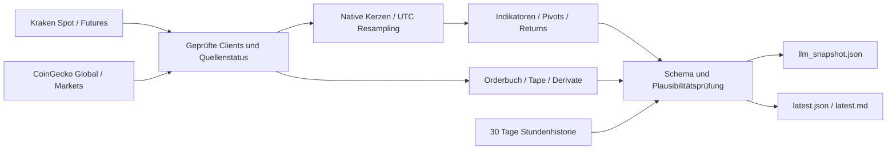

# DOT Market Monitor

[](https://github.com/exolinodev/dot-market-monitor/actions/workflows/tests.yml)
[](https://github.com/exolinodev/dot-market-monitor/actions/workflows/market-data.yml)

Deterministische, quellengebundene Daten für einen stündlichen ChatGPT DOT-Monitor. Python liefert Messwerte, Indikatoren, Struktur und mathematische Flags. Elliott-Counts, Wahrscheinlichkeiten, Handelsinterpretation und fundamentale Bedeutungsbewertung bleiben ausserhalb des Scripts.

**Eine Datei für ChatGPT:** [data/llm_snapshot.json](https://raw.githubusercontent.com/exolinodev/dot-market-monitor/main/data/llm_snapshot.json) · [lesbare Übersicht](data/latest.md) · [Actions](https://github.com/exolinodev/dot-market-monitor/actions/workflows/market-data.yml)

## Instrumente und Timeframes

| Instrument | Timeframes / Daten |
|---|---|
| DOT/USD Spot | 1m, **3m**, 5m, 15m, 30m, 1h, **2h**, 4h, **12h**, 1d, **2d**, **4d**, 1w |
| DOT/BTC | 1m, 5m, 15m, 30m, 1h, 4h, 1d, 1w; 1h/4h/24h/7d Returns |
| BTC/USD | 15m, 1h, 4h, 1d, 1w; Abstand zu 80k/70k/60k |
| ETH/BTC | aktueller Preis und 1h/24h/7d Returns |
| ETH/USD | Stundenreturns für Korrelation/Beta |
| DOT Perpetual | PF_DOTUSD Ticker, Mark/Index/Last, OI, Funding, Basis, Orderbuch und Tape |
| Altcoin-Breadth | ETH, BNB, XRP, SOL, DOGE, ADA, LINK, AVAX; DOT als Vergleich |
| Gesamtmarkt | BTC-/ETH-Dominanz, Market Cap, Volumen und TOTAL3-Proxy |

Fette Intervalle werden deterministisch aus kleineren Kraken-Kerzen resampelt. Native Intervalle werden direkt geladen. UTC-Regeln, offene/geschlossene Kerzen und Grenzen der Kraken-Historie sind in [FORMULAS.md](docs/FORMULAS.md) exakt beschrieben.

Pro DOT-Timeframe: RSI14, Stoch RSI14/3/3, MACD12/26/9, EMA9/20/21/50/100/200, SMA50/200, DEMA20, ATR14/ATR%, Bollinger20/2/Bandwidth, ADX14/+DI/−DI, OBV, MFI14, CMF20, Volumen-SMA/Ratio/Z und Intraday-Session-VWAP. Jeweils `live`, `last_closed`, Slope und relevante Cross-Events mit Bars seit dem Cross. Kontextinstrumente enthalten die verlangten Kernindikatoren in der kompakten Datei; `latest.json` enthält die vollständigen Berechnungen.

Zusätzlich: bestätigte Fractal- und ATR-ZigZag-Pivots, HH/HL/LH/LL, regelbasierte RSI/MACD-Divergenzen, Fibs aus 0.7324→1.2848 und aktuellen Hauptpivots, bedingte Preisüberlappungsflags, Depth bis ±200bps, Walls, Slippage für USD-/DOT-Grössen, taker-seitige 1m–4h Tape-Aggregate und CVD, Absorptionskandidaten, relative Returns, Korrelation/Beta und realisierte Volatilität.

## Architektur und Dateien



| Datei / Modul | Inhalt |
|---|---|
| `src/kraken.py`, `coingecko.py`, `common.py` | echte Responses, Parser, Timeouts, Retries, Circuit Breaker, Freshness |
| `src/timeframes.py`, `indicators.py`, `structure.py` | Kerzen, Formeln, kausale Struktur, Divergenzen, Fibs |
| `src/orderflow.py`, `analytics.py`, `history.py` | Orderflow, relative Messwerte, rollender Zustand |
| `src/pipeline.py`, `output.py`, `main.py` | isolierte Sammlung, Ausgabe, Schema-Prüfung |
| `data/llm_snapshot.json` | kompakter Consumer-Snapshot; keine Raw-Candle-Arrays |
| `data/latest.json`, `data/latest.md` | detaillierte Messwerte und Übersicht |
| `data/history.json` | maximal 720 echte Stundenbeobachtungen / 30 Tage |
| `data/raw/latest.json.gz` | letzte öffentliche HTTP-Responses, Quellen und Berechnungskontext |
| `data/raw/ohlc_cache.json.gz` | maximal 4096 native Kerzen pro Instrument/Intervall |
| `schema/llm_snapshot.schema.json` | JSON Schema Draft 2020-12 plus zusätzliche numerische Prüfung |
| `tests/fixtures/` | echte öffentliche Kraken-/CoinGecko-Responses mit Capture-Manifest |

Raw-Dateien werden jeweils ersetzt; es entstehen keine neuen grossen Dateien pro Stunde. Die Git-Historie wächst dennoch durch stündliche Daten-Commits. Tests verwenden eingefrorene Fixtures und synthetische Referenzreihen, niemals aktuelle Marktpreise. Es werden keine privaten Konto-, Order- oder Positionsdaten abgefragt.

## Datenquellen und Einheiten

Öffentliche [Kraken Spot API](https://docs.kraken.com/openapi/spot-rest.yaml): `Ticker`, `OHLC`, `Trades`, `Spread`, `Depth`. Öffentliche [Kraken Futures API](https://docs.kraken.com/openapi/futures-rest.yaml): `tickers/PF_DOTUSD`, `instruments`, `orderbook`, `history` mit `lastTime`-Pagination. Die Futures-Feldnamen wurden am echten Response geprüft; unbekannte Felder bleiben im Raw-Archiv, fehlende optionale Felder werden null.

[CoinGecko Global](https://api.coingecko.com/api/v3/global) und [Coins/Markets](https://api.coingecko.com/api/v3/coins/markets): historische 1h/24h/7d Coin-Returns aus tatsächlich gelieferten Feldern. Dominanz-/TOTAL3-Veränderungen werden aus eigenen Stunden-Snapshots berechnet. TOTAL3 ist ausdrücklich ein Proxy auf Basis des CoinGecko-Universums.

Preise: USD, bei DOT/BTC und ETH/BTC BTC. Spot- und PF_DOTUSD-Mengen: DOT; Futures-Instrumenttyp, Base/Quote und Contract Size werden geprüft. Basis: USD / bps / Prozent. Funding: unveränderte **absolute API-Rate**, keine erfundene Prozent- oder Jahresrendite. Tape-Richtung stammt von der Exchange. Ein Spread-Mittelpunkt wird als `current_price_type=spread_midpoint` gekennzeichnet; er ist kein behaupteter Ausführungspreis.

## Consumer-Schema v2 und Freshness

`meta`: Version, generiert UTC, Sammelbeginn, Laufdauer, Formelversion, Dokument-TTL. `sources`: ID/URL, Source- und Empfangszeit, Zeitstempelart, Alter, Freshness, Status und Fehler. `markets`: Instrumente und pro Timeframe `live`, `last_closed`, bestätigte `structure`. Weitere Blöcke: `breadth`, `global_market`, `relative_strength_dot_btc`, `correlation_beta`, `history_changes`, `wall_persistence`, `errors`.

Die kompakte Datei verwendet selbstbeschriebene Tabellen:

- `meta.cross_event_columns`: Cross-Werte sind `[direction, bars_since]`; null bedeutet kein belegter Cross in der verfügbaren Historie.
- `meta.pivot_columns`: Pivotzeilen sind `[kind, time_utc, price, confirmed_at_utc, classification, reversal_threshold]`; acht pro Verfahren. Fractals haben keine ATR-Schwelle.
- `meta.history_delta_columns`: Historienänderungen sind `[absolute, relative_pct]`; null bei fehlendem aktuellem oder Referenzwert. Der Blockstatus und `reference_utc` zeigen die Verfügbarkeit.

Alle Spaltennamen stehen in derselben Datei. Struktur wird pro Timeframe einmal geliefert; Live-Indikatoren dürfen offene Kerzen verwenden, bestätigte Pivots nie. Detaillierte False-Divergenz-Diagnostik, zwölf Pivots und genaue Cross-Zeitpunkte stehen in `latest.json`.

Consumer müssen `meta.generated_at_utc` selbst gegen ihre Uhr prüfen: **maximal 90 Minuten**. `meta.fresh` ist kein dauerhaft gültiges Versprechen. Danach Quellen und Komponenten einzeln prüfen. `partial` ist eine verwendbare Datei mit Einschränkungen. Kein alter Preis wird stillschweigend als neuer Wert übernommen. Selbst ein kompletter API-Ausfall liefert ein neues Fehlerdokument mit null-Werten. Tests prüfen auch diesen Fall.

Warmup und Grenzen sind normale Zustände: 4d EMA/SMA200 brauchen mehr als die initial verfügbaren Kraken-Tageskerzen; 1m-Session-VWAP braucht den echten UTC-Tagesbeginn. Echte 1h/4h/24h/7d-Historienänderungen erscheinen erst nach ausreichender Laufzeit. Incomplete Tape-Window-Werte sind beobachtete Teilsummen, keine behaupteten Gesamtvolumen. Wall-Persistenz beweist weder Orderidentität noch Spoofing. [Alle Formeln und Grenzen](docs/FORMULAS.md).

## Lokal ausführen

Python 3.12, wie im Workflow:

```bash
git clone https://github.com/exolinodev/dot-market-monitor.git
cd dot-market-monitor
python3.12 -m venv .venv
source .venv/bin/activate
python -m pip install -r requirements.txt
python -m pytest -q
python src/main.py
python scripts/validate_snapshot.py --live
```

Optional: `COINGECKO_API_KEY` als Umgebungsvariable oder GitHub Actions Secret mit einem Demo-API-Key. Kraken braucht keinen Schlüssel. CoinGecko wird ohne Schlüssel versucht; Einschränkungen oder Rate Limits werden als Quellenstatus gemeldet. Keine `.env` oder Tokens committen.

## GitHub Actions

Der Collector läuft **stündlich um :55**, manuell per `workflow_dispatch` und bei Änderungen an Collector, Schema oder Abhängigkeiten auf `main`. GitHub-Zeitpläne sind Best Effort; ChatGPT um :05 soll immer die tatsächliche Freshness prüfen.

`contents: write`, eine gemeinsame Concurrency-Gruppe, Python-/pip-Cache, Tests **vor** Datenerzeugung, harte Schema-/Plausibilitätsprüfung und Commit nur bei geänderten Daten. Nur die sechs festgelegten Output-/State-Dateien werden gestaged. Ein manueller Prüflauf:

```bash
gh workflow run market-data.yml --repo exolinodev/dot-market-monitor --ref main
gh run list --repo exolinodev/dot-market-monitor --workflow market-data.yml
gh run watch RUN_ID --repo exolinodev/dot-market-monitor --exit-status
```

Schema v2 ersetzt den bisherigen v1-Consumer-Vertrag. Den stündlichen ChatGPT-Monitor auf die [neue Raw-URL](https://raw.githubusercontent.com/exolinodev/dot-market-monitor/main/data/llm_snapshot.json) umstellen. Ein passender [Consumer-Prompt](CHATGPT_MONITOR_PROMPT.md) liegt bei.
