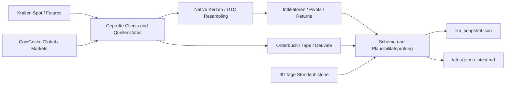

# DOT Market Monitor

[](https://github.com/exolinodev/dot-market-monitor/actions/workflows/tests.yml)
[](https://github.com/exolinodev/dot-market-monitor/actions/workflows/market-data.yml)

Deterministische, quellengebundene Daten für einen stündlichen ChatGPT DOT-Monitor. Python liefert Messwerte, Indikatoren, Struktur und mathematische Flags. Elliott-Counts, Wahrscheinlichkeiten, Handelsinterpretation und fundamentale Bedeutungsbewertung bleiben ausserhalb des Scripts.

**Vollständiger Snapshot:** [data/llm_snapshot.json](https://raw.githubusercontent.com/exolinodev/dot-market-monitor/main/data/llm_snapshot.json) · [lesbare Übersicht](data/latest.md) · [Actions](https://github.com/exolinodev/dot-market-monitor/actions/workflows/market-data.yml)

## Oracle v3

Der additive Block `markets.DOTUSD.oracle_context` verbindet deterministische
Erschöpfungs-/Fortsetzungsfeatures, historische Marktanalogs und eine nach Versionen
getrennte Forecast-Scorecard. Der neue [Consumer-Prompt](CHATGPT_MONITOR_PROMPT.md)
beginnt mit einem bedingten ORACLE CALL und trennt Makrostruktur von taktischer
Handelsrichtung. **Messwerte bleiben autoritativ; Python bewertet, das LLM prognostiziert.**

Forecasts und gebundene Inputs werden create-only archiviert. Der stündliche Job
wertet gereifte 1h/4h/12h-Prognosen anhand geschlossener Spot-Candles aus, auch ohne
erreichbares LLM. Mehrdeutige Barrier-Reihenfolgen bleiben `ambiguous`, fehlende Daten
bleiben unbekannt. Schema v2 und der bisherige Measurements-only-Vertrag bleiben gültig.

Für Dateitools mit gekürzten Antworten erzeugt der Collector zusätzlich
`data/oracle/consumer/index.json` und verknüpfte Teile von höchstens 10 KB.
Sie enthalten Originalwerte mit Feldpfad und bindendem Snapshot-Hash. Der
[Job-Betrieb samt echtem Browser-Test](docs/ORACLE_JOB_OPERATIONS.md) beschreibt
Stundentakt, Übergangsmodus, begrenzten Wiederanlauf und die Zugriffskorrektur.

[Architektur, Formeln, Write-back und Grenzen](docs/ORACLE_V3.md) ·
[Replay und Washout-Fallstudie](docs/evaluation/oracle-v3/RESULTS.md) ·
[Forecast-Schema](schema/oracle_forecast.schema.json)

Die aktuelle Evidenz reicht für prospektiven Parallelbetrieb, nicht für eine
Profitabilitätsbehauptung. Es existiert noch kein echter Modell-Scorecard-Verlauf
und ohne verfügbare Modell-API wurde kein Modell-Prompt-Backtest vorgetäuscht.

## Instrumente und Timeframes

| Instrument | Timeframes / Daten |
|---|---|
| DOT/USD Spot | 1m, **3m**, 5m, 15m, 30m, 1h, **2h**, 4h, **12h**, 1d, **2d**, **4d**, 1w |
| DOT/BTC | 1m, 5m, 15m, 30m, 1h, 4h, 1d, 1w; 1h/4h/24h/7d Returns |
| BTC/USD | 15m, 1h, 4h, 1d, 1w; Abstand zu 80k/70k/60k |
| ETH/BTC | aktueller Preis und 1h/24h/7d Returns |
| ETH/USD | Stundenreturns für Korrelation/Beta |
| DOT Perpetual | PF_DOTUSD Ticker, Mark/Index/Last, OI, Funding, Basis, Orderbuch und Tape |
| Altcoin-Breadth | ETH, BNB, XRP, SOL, DOGE, ADA, LINK, AVAX; DOT als Vergleich |
| Gesamtmarkt | BTC-/ETH-Dominanz, Market Cap, Volumen und TOTAL3-Proxy |

Fette Intervalle werden deterministisch aus kleineren Kraken-Kerzen resampelt. Native Intervalle werden direkt geladen. UTC-Regeln, offene/geschlossene Kerzen und Grenzen der Kraken-Historie sind in [FORMULAS.md](docs/FORMULAS.md) exakt beschrieben.

Pro DOT-Timeframe: RSI14, Stoch RSI14/3/3, MACD12/26/9, EMA9/20/21/50/100/200, SMA50/200, DEMA20, ATR14/ATR%, Bollinger20/2/Bandwidth, ADX14/+DI/−DI, OBV, MFI14, CMF20, Volumen-SMA/Ratio/Z und Intraday-Session-VWAP. Jeweils `live`, `last_closed`, Slope und relevante Cross-Events mit Bars seit dem Cross. Kontextinstrumente enthalten die verlangten Kernindikatoren in der kompakten Datei; `latest.json` enthält die vollständigen Berechnungen.

Zusätzlich: bestätigte Fractal- und ATR-ZigZag-Pivots, HH/HL/LH/LL, regelbasierte RSI/MACD-Divergenzen, Fibs aus 0.7324→1.2848 und aktuellen Hauptpivots, bedingte Preisüberlappungsflags, Depth bis ±200bps, Walls, Slippage für USD-/DOT-Grössen, taker-seitige 1m–4h Tape-Aggregate und CVD, Absorptionskandidaten, relative Returns, Korrelation/Beta und realisierte Volatilität.

`markets.DOTUSD.time_fibs` liefert UTC-Zeitprojektionen aus explizit konfigurierten bestätigten Spot-Pivots. Der additive Block `markets.DOTUSD.observations` ergänzt **reine Messwerte**: Schlusskursbeobachtungen an Preislevels, Anchored VWAP, historische Perzentile, rückblickende beta-bereinigte Renditen, benachbarte Orderflow-Fenster, echtes Trade-Volumen nach Preis, Spot-/Perp-Veränderungen, Kraken-/Coinbase-Spot-Quotevergleich und ein begrenztes verifiziertes Terminregister. Richtungsprognosen, Scores, Marktregime und Elliott-Szenarien werden dort nicht erzeugt. Die stündliche ChatGPT-Auswertung bleibt beim [Consumer-Prompt](CHATGPT_MONITOR_PROMPT.md).

## Architektur und Dateien



| Datei / Modul | Inhalt |
|---|---|
| `src/kraken.py`, `coingecko.py`, `common.py` | echte Responses, Parser, Timeouts, Retries, Circuit Breaker, Freshness |
| `src/timeframes.py`, `indicators.py`, `structure.py` | Kerzen, Formeln, kausale Struktur, Divergenzen, Fibs |
| `src/orderflow.py`, `analytics.py`, `history.py` | Orderflow, relative Messwerte, rollender Zustand |
| `src/observations.py`, `observation_*.py` | isolierte Beobachtungen, Candle-/Trade-Messwerte, einjährige Beobachtungshistorie, Offline-Replay |
| `src/coinbase.py`, `event_calendar.py` | öffentlicher DOT/USD-Quotevergleich und explizit verifizierte Termine |
| `config/observations.json`, `time_fibs.json`, `scheduled_events.json` | sichtbare Parameter, manuelle Anchor-Auswahl, Terminquellen und Genauigkeit |
| `src/oracle_*.py` | Features, Archiv, immutable Forecasts, Spot-Evaluator, Analogs, Scorecard und kompakter Kontext |
| `config/oracle.json`, `schema/oracle*.schema.json` | versionierte Parameter und strikte Oracle-Verträge |
| `data/raw/oracle_market_outcomes.json.gz` | gereifte historische Markt-Outcomes, unabhängig von Modellforecasts, über den Minuten-Cache hinaus erhalten |
| `data/raw/oracle_feature_history.json.gz` | tatsächliche Stundenfeatures mit Originalinputs und Configs, ab Collector-Deployment |
| `data/oracle/forecasts`, `inputs`, `outcomes`, `outcome_inputs` | unveränderliche Forecast- und Evaluationsnachweise |
| `data/oracle_scorecard.json` | deterministische, nach Strategie und Methodik getrennte Ergebnisse |
| `data/oracle/consumer/` | rollierender Index und begrenzte Originalfeld-Projektionen für Dateitools |
| `src/pipeline.py`, `output.py`, `main.py` | isolierte Sammlung, Ausgabe, Schema-Prüfung |
| `data/llm_snapshot.json` | kompakter Consumer-Snapshot; keine Raw-Candle-Arrays |
| `data/latest.json`, `data/latest.md` | detaillierte Messwerte und Übersicht |
| `data/history.json` | maximal 720 echte Stundenbeobachtungen / 30 Tage |
| `data/raw/latest.json.gz` | letzte öffentliche HTTP-Responses, Quellen und Berechnungskontext |
| `data/raw/ohlc_cache.json.gz` | maximal 4096 native Kerzen pro Instrument/Intervall |
| `data/raw/observation_history.json.gz` | maximal 365 Tage tatsächlicher Stundenbeobachtungen plus verwendete Konfigurationen; beginnt mit dem neuen Collector |
| `schema/llm_snapshot.schema.json` | JSON Schema Draft 2020-12 plus zusätzliche numerische Prüfung |
| `schema/observations.schema.json`, `observations.config.schema.json` | strikter neuer Messwertvertrag und Parameterprüfung; lokal ohne Netzwerk aufgelöst |
| `tests/fixtures/` | echte öffentliche Kraken-/CoinGecko-Responses mit Capture-Manifest |

Raw-Dateien werden jeweils ersetzt; es entstehen keine neuen grossen Dateien pro Stunde. Die Git-Historie wächst dennoch durch stündliche Daten-Commits. Tests verwenden eingefrorene Fixtures und synthetische Referenzreihen, niemals aktuelle Marktpreise. Es werden keine privaten Konto-, Order- oder Positionsdaten abgefragt.

Die neue Beobachtungshistorie ergänzt die bestehende 30-Tage-History. Sie enthält keine Prognosen oder Ergebnislabels und füllt fehlende Zeiträume nicht rückwirkend auf. Neue Kennzahlen nennen Zeitfenster, Quellen, Stichprobengrösse und Einschränkungen. Ein `partial`-Status beschreibt Datenverfügbarkeit. Das Terminregister wird bewusst manuell verifiziert; aktuelle Einträge enthalten nur belegte FOMC-Sitzungstage, keine behaupteten Entscheidungsuhrzeiten und keine vollständige Makro-/DOT-Ereignisabdeckung.

## Datenquellen und Einheiten

Öffentliche [Kraken Spot API](https://docs.kraken.com/openapi/spot-rest.yaml): `Ticker`, `OHLC`, `Trades`, `Spread`, `Depth`. Öffentliche [Kraken Futures API](https://docs.kraken.com/openapi/futures-rest.yaml): `tickers/PF_DOTUSD`, `instruments`, `orderbook`, `history` mit `lastTime`-Pagination. Die Futures-Feldnamen wurden am echten Response geprüft; unbekannte Felder bleiben im Raw-Archiv, fehlende optionale Felder werden null.

Zusätzlich: öffentliche Coinbase Exchange [`DOT-USD`-Produktdefinition](https://api.exchange.coinbase.com/products/DOT-USD) und [`book?level=1`](https://api.exchange.coinbase.com/products/DOT-USD/book?level=1). Geprüft werden Spot-Produkt, USD-Quote, Handelsstatus, Mengen und Exchange-Zeitstempel; die Kraken-Kerzen und bestehenden Spotpreise werden dadurch nicht ersetzt. Der zusätzliche Client braucht keinen API-Key. Termine stammen aus dem [offiziellen Fed-Kalender](https://www.federalreserve.gov/monetarypolicy/fomccalendars.htm), mit Verifikationszeit und Quellenbeleg im Repository.

[CoinGecko Global](https://api.coingecko.com/api/v3/global) und [Coins/Markets](https://api.coingecko.com/api/v3/coins/markets): historische 1h/24h/7d Coin-Returns aus tatsächlich gelieferten Feldern. Dominanz-/TOTAL3-Veränderungen werden aus eigenen Stunden-Snapshots berechnet. TOTAL3 ist ausdrücklich ein Proxy auf Basis des CoinGecko-Universums.

Preise: USD, bei DOT/BTC und ETH/BTC BTC. Spot- und PF_DOTUSD-Mengen: DOT; Futures-Instrumenttyp, Base/Quote und Contract Size werden geprüft. Basis: USD / bps / Prozent. Funding: unveränderte **absolute API-Rate**, keine erfundene Prozent- oder Jahresrendite. Tape-Richtung stammt von der Exchange. Ein Spread-Mittelpunkt wird als `current_price_type=spread_midpoint` gekennzeichnet; er ist kein behaupteter Ausführungspreis.

## Consumer-Schema v2 und Freshness

`meta`: Version, generiert UTC, Sammelbeginn, Laufdauer, Formelversion, Dokument-TTL. `sources`: ID/URL, Source- und Empfangszeit, Zeitstempelart, Alter, Freshness, Status und Fehler. `markets`: Instrumente und pro Timeframe `live`, `last_closed`, bestätigte `structure`. Weitere Blöcke: `breadth`, `global_market`, `relative_strength_dot_btc`, `correlation_beta`, `history_changes`, `wall_persistence`, `errors`.

Die kompakte Datei verwendet selbstbeschriebene Tabellen:

- `meta.cross_event_columns`: Cross-Werte sind `[direction, bars_since]`; null bedeutet kein belegter Cross in der verfügbaren Historie.
- `meta.pivot_columns`: Pivotzeilen sind `[kind, time_utc, price, confirmed_at_utc, classification, reversal_threshold]`; acht pro Verfahren. Fractals haben keine ATR-Schwelle.
- `meta.history_delta_columns`: Historienänderungen sind `[absolute, relative_pct]`; null bei fehlendem aktuellem oder Referenzwert. Der Blockstatus und `reference_utc` zeigen die Verfügbarkeit.

Alle Spaltennamen stehen in derselben Datei. Struktur wird pro Timeframe einmal geliefert; Live-Indikatoren dürfen offene Kerzen verwenden, bestätigte Pivots nie. Detaillierte False-Divergenz-Diagnostik, zwölf Pivots und genaue Cross-Zeitpunkte stehen in `latest.json`.

Consumer müssen `meta.generated_at_utc` selbst gegen ihre Uhr prüfen: **maximal 90 Minuten**. `meta.fresh` ist kein dauerhaft gültiges Versprechen. Danach Quellen und Komponenten einzeln prüfen. `partial` ist eine verwendbare Datei mit Einschränkungen. Kein alter Preis wird stillschweigend als neuer Wert übernommen. Selbst ein kompletter API-Ausfall liefert ein neues Fehlerdokument mit null-Werten. Tests prüfen auch diesen Fall.

Warmup und Grenzen sind normale Zustände: 4d EMA/SMA200 brauchen mehr als die initial verfügbaren Kraken-Tageskerzen; 1m-Session-VWAP braucht den echten UTC-Tagesbeginn. Echte 1h/4h/24h/7d-Historienänderungen erscheinen erst nach ausreichender Laufzeit. Incomplete Tape-Window-Werte sind beobachtete Teilsummen, keine behaupteten Gesamtvolumen. Wall-Persistenz beweist weder Orderidentität noch Spoofing. [Alle Formeln und Grenzen](docs/FORMULAS.md).

## Lokal ausführen

Python 3.12, wie im Workflow:

```bash
git clone https://github.com/exolinodev/dot-market-monitor.git
cd dot-market-monitor
python3.12 -m venv .venv
source .venv/bin/activate
python -m pip install -r tests/requirements.txt
python -m pytest -q
python src/main.py
python scripts/validate_snapshot.py --live
```

Offline neu generieren: `python src/main.py --from-latest`. Das verwendet die gespeicherten Messwerte, Raw-Trades und Quellen-Empfangszeiten, behält die ursprüngliche Snapshot-Zeit bei und schreibt keine History-/Cache-Beobachtungen hinzu. Neue Quellen, die im alten Raw-Archiv fehlen, bleiben unavailable/partial. Die bestehende v2-Struktur bleibt gültig, wenn der neue Beobachtungsblock fehlt.

Optional: `COINGECKO_API_KEY` als Umgebungsvariable oder GitHub Actions Secret mit einem Demo-API-Key. Kraken braucht keinen Schlüssel. CoinGecko wird ohne Schlüssel versucht; Einschränkungen oder Rate Limits werden als Quellenstatus gemeldet. Keine `.env` oder Tokens committen.

Oracle offline prüfen: `python scripts/oracle_replay.py`. Forecast veröffentlichen:
`python scripts/oracle.py publish forecast.json --snapshot exact_snapshot.json`.
Der separate Workflow `oracle-forecast.yml` bietet denselben geprüften Write-back
mit autorisiertem GitHub-Zugriff. Vorhandene Forecast-IDs werden niemals ersetzt.
Details und Modell-Evaluationsharness: [Oracle v3](docs/ORACLE_V3.md).

Für reine Datensammlung genügt `python -m pip install -r requirements.txt`; pytest wird nur über `tests/requirements.txt` installiert.

## GitHub Actions

**Cloudflare prüft alle fünf Minuten; eine neue Sammelrunde beginnt um :50 UTC. Ein unabhängiger GitHub-Zeitplan um :52 dient als Ersatz.** Frische Daten und laufende Collector verhindern weitere Starts. Der Ersatzjob überspringt bei aktuellen Daten Python-Setup, Dependencies und Sammlung. Auch verspätete Prüfungen können fehlende Daten nachholen. Details: [Cloudflare-Starter](docs/CLOUDFLARE_SCHEDULER.md).

Ziel: Daten bis zur folgenden vollen Stunde verfügbar machen. Der Puffer berücksichtigt Startverzögerungen, Laufzeit und den GitHub-Raw-Cache (beobachtet: bis zu fünf Minuten). Auch Cloudflare und extern gestartete GitHub-Runner bieten keine feste Zusage zur vollen Stunde. ChatGPT muss immer `meta.generated_at_utc` und die Quellen-Freshness prüfen. Der Snapshot enthält den tatsächlichen Erfassungszeitpunkt und keine vorgetäuschten Kurse der vollen Stunde. Manuelle Starts per `workflow_dispatch` und passende Code-Pushes auf `main` bleiben möglich.

Der stündliche Job besteht aus Checkout des aktuellen `main`, Python-/pip-Cache, Installation der Produktionsabhängigkeiten, Datensammlung und bedingtem Commit. Er installiert kein pytest und führt keine Tests aus. Die harte Schema-/Plausibilitätsprüfung bleibt direkt in `src/main.py` vor dem Schreiben enthalten. `contents: write` und eine gemeinsame Concurrency-Gruppe erlauben geordnete Daten-Updates. Die festgelegten Output-/State-Dateien einschliesslich der neuen Beobachtungshistorie werden gestaged; `git diff --cached --quiet` verhindert Commits ohne Änderungen.

Der separate Testworkflow läuft ausschliesslich bei Pushes auf `main` oder Pull Requests mit Änderungen an `src/**`, `tests/**`, `config/**`, `schema/**`, `requirements.txt`, `scripts/collection_due.py` oder `.github/workflows/**`. Reine Daten- und README-Änderungen starten keine Tests. Er installiert zusätzlich die gepinnten Test-Abhängigkeiten aus `tests/requirements.txt` und prüft den Cloudflare-Starter mit `node --test tests/scheduler.test.mjs`. Node und Wrangler werden nicht im stündlichen Collector installiert.

Bei 24 geplanten Läufen täglich entstehen 720 Collector-Jobs pro 30 Tage; Test-Jobs kommen nur bei passenden Codeänderungen hinzu. Bei beispielsweise 40 Sekunden pro Collector sind das acht Stunden tatsächliche Laufzeit pro 30 Tage. Die wirkliche Dauer steht im jeweiligen Actions-Run. Für dieses öffentliche Repository sind Standard-GitHub-Runner kostenlos; bei privaten Repositories gelten Kontingente und die Abrechnung pro Job mit aufgerundeten Minuten.

Ein manueller Collector-Prüflauf:

```bash
gh workflow run market-data.yml --repo exolinodev/dot-market-monitor --ref main
gh run list --repo exolinodev/dot-market-monitor --workflow market-data.yml
gh run watch RUN_ID --repo exolinodev/dot-market-monitor --exit-status
```

Schema v2 ersetzt den bisherigen v1-Consumer-Vertrag. Den stündlichen ChatGPT-Monitor auf die [neue Raw-URL](https://raw.githubusercontent.com/exolinodev/dot-market-monitor/main/data/llm_snapshot.json) umstellen. Ein passender [Consumer-Prompt](CHATGPT_MONITOR_PROMPT.md) liegt bei.

### Daten sofort aktualisieren

[Collector öffnen](https://github.com/exolinodev/dot-market-monitor/actions/workflows/market-data.yml) → **Run workflow** → **main** → **Run workflow**.
Ein zweiter manueller Start innerhalb von zwei Minuten nach einem gültigen Snapshot überspringt die Sammlung.
Alternativ: `gh workflow run market-data.yml --repo exolinodev/dot-market-monitor --ref main`.

Ein grüner Workflow allein genügt nicht: Im [Snapshot](https://raw.githubusercontent.com/exolinodev/dot-market-monitor/main/data/llm_snapshot.json) muss `meta.generated_at_utc` aktuell sein.

Die stündliche ChatGPT-Aufgabe kann mit einem autorisierten GitHub-Anschluss den
Collector selbst neu starten. [Berechtigungen und Ablauf](docs/CHATGPT_RECOVERY.md).
