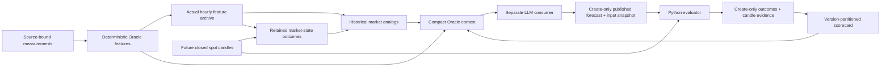

# Oracle v3

Oracle adds a conditional forecast lifecycle to the existing deterministic monitor.
It does not turn measurement facts into model opinions. Root snapshot schema stays
**2**; `markets.DOTUSD.oracle_context` is optional, separately versioned **1**.
Existing observations retain `contract=measurements_only` with no changed meanings.
The feature methodology and default consumer strategy are `3.0.0` and
`oracle-v3.0.0`. This is an initial prospective system, not demonstrated trading alpha.

## Architecture and ownership



The hourly collector never calls a model or requires a model API. Feature failure,
archive corruption or an invalid forecast is reported through an explicit error
Oracle context and `errors`; market measurement collection still publishes. A bad
forecast currently disables the Oracle block until repaired/reviewed; it does not
silently disappear from performance statistics. Existing measurement computations,
source timestamps, 90-minute consumer TTL, null/error handling, time-fib rules,
raw observations and pivot confirmation rules are preserved.

Modules are intentionally separate: `oracle_features` (causal measurements),
`oracle_history` (hourly feature archive), `oracle_forecasts` (schema and immutable
publication), `oracle_evaluator` (future labels), `oracle_scorecard` (model results),
`oracle_analogs` / `oracle_market_history` (forecast-independent history and retained labels), `oracle_context` (assembly/isolation).
Schemas cover config, feature record, forecast, outcome, retained market labels,
scorecard and context.

## Inputs, lineage and features

A feature record stores the measurement-config hash, Oracle-config hash, feature
version, reference timestamp, canonical input SHA256, feature values and evidence
families. Each value has explicit units, status/reason, source IDs, time coverage
and methodology. No host clock is read during deterministic computation.
`feature_inputs` accepts the original detailed or compact measurement snapshot;
its exact selected source/candle/observation inputs are retained in the archive.

The existing candle `asof_utc` and pivot `confirmed_at` mean **candle open**, not
close. Oracle adds the interval and verifies closure by the actual receipt time.
A candle received open before a boundary is never promoted to a closed candle
because collection finished later. Gapped/stale candle inputs are unavailable.
Manual AVWAP anchors also require recorded selection no later than the snapshot.

Features include OI change and price/OI relation at 1h/4h/24h; prior-history OI and
spot/perp signed-flow percentiles; signed and absolute volume; normalised signed
flow; flow return, impact and impact change; flow/price divergence; 1h/4h CLV,
wicks/ATR, body/ATR and EMA20 extension; configured and previously confirmed pivot
level reactions/distances; subsequent reclaim persistence; AVWAP extension;
confirmed fractal transitions; relative-strength acceleration and matched-universe
breadth change. See [FORMULAS](FORMULAS.md#oracle-v3-formulas).

There is no inferred participant identity, magic reversal probability or synthetic
OI/flow history. The term “deleveraging” describes declining OI, not proven forced
liquidations. Negative flow with flat/up price is an observed divergence, not
an expansion of the existing absorption contract.

Related features are grouped in six evidence families. Price/momentum, levels and
confirmed structure still share OHLC; these families must not be counted as
statistically independent votes. `reversal_gates` reports necessary A/B/C conditions
and exact supporting IDs. It does not output a trading regime. The consumer may
combine bearish macro structure with tactical long preference. RSI alone cannot
make either reversal flag true. Breakout regimes remain explicit consumer
interpretation of confirmed price/level evidence, with an executable barrier.

## History and reproducibility

`data/raw/oracle_feature_history.json.gz` contains unique, ordered actual UTC hours,
selected original inputs, records and hash-verified configs. Current-hour replacement
is deterministic. Future rows and attempts to replace a later observation with an
earlier snapshot are rejected. Retention is configurable (365 days by default).
The current UTC hour never enters percentile/acceleration history.

The collector begins recording Oracle features after deployment. Offline
`--from-latest` never advances this archive or the measurement archive. Retrospective
research lives under `docs/evaluation/oracle-v3`, explicitly labelled as newly
computed features on original snapshots, never inserted into the live archive.
Within retained inputs, replay uses the original config and past-only records.
After retention removes the earliest baseline, exact replay of those *boundary*
records lacks their old baseline; replay at least 30 days beyond the retained
boundary has the full default percentile baseline. Original calculated feature
records remain auditable. Changing method formulas requires a feature-version bump;
changing thresholds/scales changes the config hash and isolates comparison cohorts.

## Market-state analogs (independent of forecasts)

V1 uses fixed, interpretable scale distances, not a future-fitted scaler. Coordinates
are EMA20 extension, CLV, 4h OI change, spot/perp signed-flow fraction and 4h DOT/BTC
ratio return. Scales, K, minimum shared coordinates and maximum distance are in
`config/oracle.json`. Scale choices were not optimised on this reversal.

Candidates must share feature schema/version, measurement config and Oracle config,
be older than the current hour, and have fully matured labels before the current
snapshot. Known opposite signs of hourly EMA extension are incompatible. RMS scaled
distance uses shared coordinates plus a missing-coordinate penalty. Ties sort by
timestamp. Neighbours are greedily spaced by at least the outcome horizon so one
move is not presented as many independent observations. This does not establish
statistical independence across market regimes.

Only sufficiently many neighbours (default 20 of at most 40) produce descriptive
mean/median/p10/p90 returns and excursions, or positive-return rates. Smaller samples
still report count/distance/IDs but return null statistics. These are historical
frequencies, not calibrated event probabilities.

`data/raw/oracle_market_outcomes.json.gz` fills each genuine feature-state/horizon
label once when closed-candle coverage matures. It retains method/config/input
identity, observation and evaluation times, forward returns, market MFE/MAE,
source interval and candle hash. Labels survive minute-cache rolloff and expire with
the configured history retention. Missing windows are retried, never synthesised;
existing labels are not overwritten. This allows 12h analog samples to accumulate
across weeks without requiring model forecasts or an unbounded minute cache.
Original hourly Git cache revisions remain the input evidence for replay. Each horizon's baseline is solely
information available before that particular reference timestamp.

## Forecast publication and audit

The LLM emits exactly `oracle_forecast.schema.json`: separate macro/swing/intraday/
execution biases, regime, 1h/4h/12h directional calls, executable setup, target roles,
asymmetry, three WHEN/THEN/WHY paths, supporting/opposing feature IDs, qualitative
uncalibrated confidence, and summary. All material input and strategy versions bind
the record to its exact snapshot. No model outcome or probability fields are allowed.

`python scripts/oracle.py publish forecast.json --snapshot exact_snapshot.json`
validates schema, timestamp, snapshot hash, feature evidence, positive risk, ordered
targets and nominal T1/R. It checks the necessary reversal gates for reversal regimes.
Created time must be within 120 seconds of actual publication and snapshot age within
90 minutes. Publication uses a fully written/fsynced temporary file and an atomic
hard-link to the final forecast path, failing if any file already exists:

```
data/oracle/forecasts/YYYY/MM/DD/<timestamp>-<snapshot-hash-prefix>-oracle-v3.json
data/oracle/inputs/<snapshot-sha256>.json.gz
```

`forecast_id` binds creation time to the first 12 hex digits of the snapshot hash.
The hash uses canonical sorted compact Python JSON with `allow_nan=False`.
The additive `data/oracle/consumer/index.json` projection index supplies this
Python-computed hash to consumers whose file tools truncate the full snapshot.
Its bounded parts contain exact JSON-Pointer/value records, never new market
calculations. Consumers bind to the full snapshot hash from the same commit;
the writer still retrieves and validates the complete authoritative snapshot.
Missing projected fields cannot be inferred. See
[job operations and browser verification](ORACLE_JOB_OPERATIONS.md).
An unchanged JSON input snapshot is retained to verify evidence later. No real
historical model forecasts were created for this implementation. Synthetic test
fixtures remain in tests and are not admitted as actual model performance.

With authorised GitHub access, the consumer may dispatch `oracle-forecast.yml`
with `snapshot_commit` (full main commit SHA) and `forecast_json`. The workflow reads
that precise main snapshot, validates/publishes, commits only forecast evidence,
and reads no model service. Queueing longer than the publication tolerance can
reject a forecast; create a fresh, reanalysed forecast rather than backdating it.
The consumer must verify workflow success and read the saved forecast back.
Without tools/access it must explicitly report an unpersisted draft.

CI rejects modifications/deletions of tracked forecasts, bound snapshots, final
outcomes and outcome candle evidence. Repository administrators can still bypass
Git controls: branch protection and required archive-integrity checks are needed
for an organisational immutability guarantee. Git plus create-only code is an audit
trail, not a cryptographic prevention of privileged history rewrites.

## Evaluator rules

Spot is the only supported canonical market in v1 (schema rejects other markets).
A timestamp inside a minute anchors at the next full minute. `anchor_delay_seconds`
records the excluded subminute interval; all three horizons use that common anchor.
This avoids including pre-publication high/low prices. Return is from the first
included open to the final closed candle. MFE/MAE market labels are long-oriented
positive/negative excursions from that same anchor; trade excursions use direction.

The evaluator chooses the smallest available fully covering, ordered, validated
closed-candle interval, usually 1m. Coarser candles are usable only when they cover
exactly the same boundaries. It never uses a future/open candle or bridges a gap.
No full window means `partial`/`unavailable`; not-yet-matured means `pending`.

Touch triggers use the configured spot level, or the observed open if the market
gapped through it. Close triggers require a complete 1/5/15/60/240-minute interval
ending beyond publication. Close-trigger entry occurs at that close, so its prior
extrema cannot count as post-entry hits. `failure_scope` explicitly distinguishes
a stop after activation from setup invalidation before activation. A gap that
passes the first target before a usable entry is ambiguous, not free profit.

Barrier times are candle intervals. A target and failure touched in one smallest
available candle are **ambiguous**. Touch entry and a target/failure in the same
candle are also ambiguous unless entry at its open establishes ordering. No trade
sequence is invented from OHLC; actual-trade ordering is not implemented yet.
Earlier unambiguous target milestones remain recorded, but ambiguous trade outcomes
are excluded from aggregate target-rate denominators.

R is a theoretical full-position hold to failure, T3, or horizon close; T1/T2 are
milestones, not assumed partial fills. Gap stops use the observed open when worse
than the barrier. There are no fees, spread, fill guarantees, leverage or liquidation
models. Unknown extrema within an entry/exit candle make trade MFE/MAE unavailable;
full-window market MFE/MAE remains observable. Timing means time to T1, trigger/failure
candle intervals and coverage status; there is no fabricated timing-accuracy score.
FLAT calls have no arbitrary correctness threshold and are not directional wins.

Each fully covered matured horizon is written create-only under
`data/oracle/outcomes/<forecast_id>/<evaluator-version>-<horizon>.json`, bound to the
forecast SHA256. Its exact candle rows are archived separately under
`data/oracle/outcome_inputs`. Final grades are recomputed from that evidence before
the collector or CI accepts them as feedback; a claimed grade alone is insufficient. Partial/unavailable attempts remain in
`data/oracle/pending_outcomes.json` and can be retried with better coverage.
A final outcome is never overwritten. Method changes produce a new evaluator version.

## Scorecard and compact feedback

`data/oracle_scorecard.json` retains groups separated by strategy, forecast schema,
feature version, Oracle config, measurement config, evaluator, horizon, direction
and regime. Counts distinguish triggers, no triggers, pre-entry invalidation,
ambiguity, unavailable coverage and abstention. NO_TRADE earns no trade success.
Directional sample/accuracy is separate from executable setup performance.
Target rates require a minimum resolved triggered sample (default 30). Excursion/R
distributions remain descriptive, with explicit sample counts. No Brier metric is
claimed because no probabilistic forecast contract exists.

Consumer context contains only current features, three analog summaries, up to nine
compatible scorecard groups (largest sample first, omitted count reported), three
recent forecast summaries and three matured outcome summaries. A 45,000-byte
canonical limit is enforced. Full histories and audit inputs never enter the compact
snapshot. Old incompatible strategy scorecards remain on disk, not blended into the
current strategy. Missing/rejected Oracle data produces explicit context error.

## Replay, experiments and results

Run offline verification:

```bash
python -m pytest -q
node --test tests/scheduler.test.mjs
python scripts/oracle_replay.py
python src/main.py --from-latest
python scripts/validate_snapshot.py
```

[Replay results](evaluation/oracle-v3/RESULTS.md) and the compressed
`example_llm_snapshot.json.gz` preserve the verified historical example separately
from live collector-owned outputs. The report contains the measured sample sizes,
coverage and timestamp-specific washout case. The replay scans original Git snapshot
revisions (default `origin/main`, or pin `--ref COMMIT_SHA` for reproduction), deduplicates true UTC hours and walks forward. Stored source freshness,
measurements and missing fields remain as observed. It does not recreate old OI or
flow from current candles. Original candle-cache revisions are walked in chronological order and matured
market labels are retained as they become available. This recovers genuine early
outcomes that are no longer present in the final rolling cache. Future spot candles
are used **only** for outcome labels.
All original measurement snapshots replay twice identically before reporting.

For controlled model experiments, export historical contexts and freeze a prompt:

```bash
python scripts/oracle_replay.py --export-snapshots /tmp/oracle-snapshots
python scripts/oracle_prompt_eval.py --snapshots /tmp/oracle-snapshots --output /tmp/oracle-experiment
# Actual invocations require OPENAI_API_KEY and an explicitly selected compatible model:
python scripts/oracle_prompt_eval.py --snapshots /tmp/oracle-snapshots --output /tmp/oracle-model-run --model MODEL_ID
python scripts/oracle_prompt_eval.py --output /tmp/oracle-model-run --evaluate-with data
```

No model API key was available during implementation, so no v2/v3 model backtest or
P&L comparison is claimed. `consumer_v2_frozen.md` preserves the original prompt.
The harness skips pre-observation snapshots lacking an original measurement-config
hash, records that reason, and freezes prompt hash, selected model, exact snapshots/requests/responses
and schema-valid forecasts in an experiment folder. Each request sees only its own
past-only snapshot/context; generated outcomes are sent only to Python. Applying a
structured-output adapter to the v2 prompt must be reported as an adapter, not a
reproduction of actual past ChatGPT conversations. Historical API outputs, even if
valid, are experimental forecasts and must never enter the live publication archive.

## Workflow races and operating limits

Collection and forecast publication share the `dot-market-data` concurrency group.
Only prescribed deterministic output paths are staged by the collector; forecasts
are a separate consumer action. Both workflows fetch/rebase and retry push at most
three times. A true content conflict fails rather than replacing a binary archive,
force-pushing or rewriting a forecast. An intervening consumer forecast is evaluated
on the following collection cycle if it arrived after evaluation started.

Remaining limits: a short genuine feature history, sparse complete adjacent spot
flow windows, no actual published model forecasts yet, no calibrated probabilities,
no execution/fill model and finite minute-cache coverage. Strict simultaneous A/B/C
can miss an evolving reversal whose evidence appears in different hours. Version 1
exposes that limitation instead of fitting a persistence threshold to one reversal.
Use prospective parallel/shadow testing first; there is no basis for autonomous
live execution or a high-confidence profitability claim.
